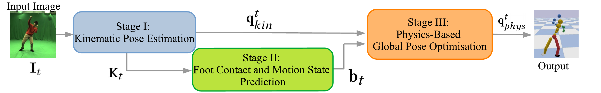
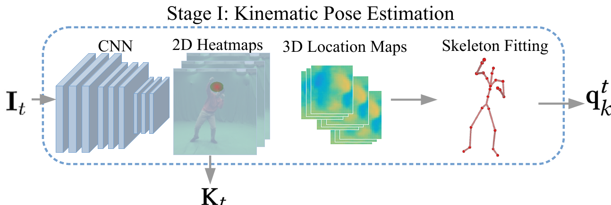

# Physcap
[Physcap](https://vcai.mpi-inf.mpg.de/projects/PhysCap/) is a paper from 2020 from Max Planck institute 
which tackles physically plausible pose estimation (without the use of "tools").
- claims on real time application.

## :one: Pose estimation
- *Kinematic* : estimate joint angles and *velocities* (no consideration of forces or torque)
- Predicts 2D & 3D joints positions.
- :one: **Pose estimation** Built on [VNect](https://vcai.mpi-inf.mpg.de/projects/VNect/) from Max Planck Institute.  
  - :rocket: "Real time"
  - :dancer: `MPI-INF-3DHP` : augmented videos from green screen markerless captures.
  - Resnet predicts, for all joints $i$ , heat maps $H_i$ + 3D maps $X_i, Y_i, Z_i$ joints locations.
- Outputs: 
  - $K_t^{\text{(2D)}}$ = detected 2D points in the plane. Probably the argmax of the heatmap $H_i$
  - $P_t^{\text{(3D)}}$ are the estimated 3D points.

> How to train?
> - Training loss $|| H_i^{GT} \odot (X_i - X_j^{GT}) ||$
> - Grountruth locations are not just characterized by coordinates but modeled by a small Gaussian.

- :two: **Inverse kinematics** by energy minimization.

Decoupled from pose estimation.
$$E(q_t) = E_{\text{Inverse Kinematics}}(q_t, P_t^{\text{(3D)}})\\ +  E_{\text{camera projection} \Pi}(q_t, K_t^{\text{2D}} )\\ +  E_{\text{Temporal Smoothness}}(q_t) +\\ E_{\text{depth}}(q_t)$$
where $q_t$ is the state (defines the joint angles at time $t$)
- Temporal smootheness: penalize accelerations on the 3D points of the joints = in the workspace (when you do forward kinematics)
- Depth penalty = :boom: **unclear** 

## :two: Contact detection

## :three: Physics based pose optimization

# Extra
[Ranking of pose estimators methods](https://paperswithcode.com/sota/3d-human-pose-estimation-on-mpi-inf-3dhp)